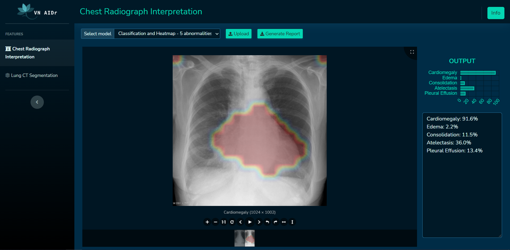

# VN AIDr - Open source medical image processing project

Project documentation (only Vietnamese): <https://dr.vnopenai.org/>.

This project contains baseline models for medical image processing and a web user interface for interacting with the system. Our goal is to create an open source code base for students, hobbylists, engineers, or even researchers to get familar with image processing, machine learning and deep learning through medical image processing problems. In this system, we also integrate natural language processing (NLP) models for automatic completion of medical reports.

Want to join us in this project? Send us a message via [our contact form](https://vnopenai.org/contact/).

<a href="https://youtu.be/pw62Hxy-BeE">
  <p><b>Click following image to play demo video.</b></p>

</a>

## Requirements

- Python 3.6 + Pip
- Detectron2: <https://detectron2.readthedocs.io/en/latest/tutorials/install.html>
- NodeJS + Yarn for frontend development

## 1. Server 

- Download pretrained models [here](https://1drv.ms/u/s!Av71xxzl6mYZgdccHa-fk9Fpnixw0Q?e=h757xp) and extract them into `trained_models`.

- Install requirements:

```
pip install -r requirements.txt
```

Or for requirements for CUDA support (require CUDA 10.2):

```
pip install -r requirements-gpu.txt
```

- Update `USE_GPU` in `configs/common.py` to `True` to enable GPU support.

- Run the server:

```
python app.py --port 8080
```

- Open `http://localhost:8080` in your browser to access web UI.


## 2. Frontend (UI)

### Development

```
cd frontend
yarn
yarn start
```

### Build

```
cd frontend
yarn
yarn build
```

## 3. Deployment using Docker

### Without GPU support

- Build image

```
docker build . -t vnaidr
```

- Run server

```
docker run -it -p 8080:8080 vnaidr
```

- Open `http://localhost:8080` in your browser to access web UI.

### With GPU support (Only NVIDIA GPU with CUDA)

- Update `USE_GPU` in `configs/common.py` to `True` to enable GPU support.

- Build image

```
docker build -t vnaidr-gpu -f Dockerfile-gpu .
```

- Run server

```
docker run --gpus all -it  -p 8080:8080  vnaidr-gpu
```

- Open `http://localhost:8080` in your browser to access web UI.

## Copyright and License

The template was developed based on [SB Admin 2](https://startbootstrap.com/theme/sb-admin-2).
